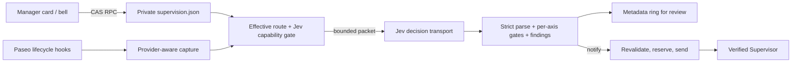

# SLP communication supervision — integration design

Status: shadow and notify implemented (revised 2026-09-26, feature parity
with `paseo-supervision` commit
[`1bad19b8`](https://github.com/hoangnb24/paseo-supervision/tree/1bad19b8ee6c58482494f56a3d8c6edb4f969ee1)).
Local checks cover the behavior below; live end-to-end validation, a
labelled model evaluation and any activation on a real daemon have **not**
run. Nothing in this document is enabled by installing or upgrading the
plugin.

History: first designed 2026-09-23 (shadow-only, presence-checking rubric,
`notify` inert). Revised 2026-09-25 (axis-scoped local gates). This revision
restores the upstream task-relative semantic rubric, adds cross-Peer
disposition, independent findings, daemon defaults for discovered Leads, and
real `notify` delivery with a header bell. A same-day UX revision (after a
live test found the card hard to use) replaced typed ids with agent pickers,
made one switch control supervision, accepted saves the plugin cannot
refresh as pending verification, and removed the Command Center items.

## Decision

Supervision is an **opt-in capability of the existing `paseo-slp` plugin**.
The reference plugin and SLP target the same workflow: a Lead briefs a Peer,
the Peer hands work back, and the Lead disposes of the obligation the
handback raises. Supervision judges whether that communication was adequate
and tells a Supervisor when it looks wrong.

It stays optional and off by default. Configuring Jev only makes it
available. Observation starts only when Jev is enabled with
`capabilities.supervision` **and** the Human selects `shadow` or `notify`
for a Lead — through daemon defaults for discovered SLP Leads or an explicit
per-Lead route. Turning it off stops new capture, assessment and delivery
without changing other Jev uses, provider setup, role injection, routing or
on-demand `monitor`.

The output is always a **suspected communication issue for review**. It is
never artifact acceptance, a Lead verdict, authority, permission to alter an
assignment, or an automatic Peer follow-up. `notify` only prompts the chosen
Supervisor, who decides within its own assignment.

## Upstream feature mapping

| Upstream behavior | SLP behavior and reason |
| --- | --- |
| Fixed providers `codex-lead`/`codex-peer`/`codex-supervisor` ([`server/config.ts`](https://github.com/hoangnb24/paseo-supervision/blob/1bad19b8ee6c58482494f56a3d8c6edb4f969ee1/server/config.ts)). | Roles derive from [`plugin/shared/families.ts`](../../plugin/shared/families.ts) — the twelve exact `slp-<family>-<role>` ids. Providers outside the registry are never auto-classified. |
| Every discovered Lead routes to one UI-selected Supervisor. | Same outcome, opt-in: **daemon defaults** apply to every discovered SLP Lead without an explicit route; explicit per-Lead routes override (an explicit `off` wins). Defaults are off until the Human selects a mode. Rooms never mix: each case is judged against its own Lead's communication. |
| Semantic three-question rubric ([`server/jev.ts`](https://github.com/hoangnb24/paseo-supervision/blob/1bad19b8ee6c58482494f56a3d8c6edb4f969ee1/server/jev.ts)). | Restored as rubric 2 with SLP terms, plus `no_action_required` and code-offered link questions (below). |
| All-axis veto: any unknown axis makes the whole decision unknown. | Not copied. Findings are independent per axis; an unknown axis never erases another axis's supported finding. |
| `JEV_API_KEY` env, TypeSafe only, 15 s timeout. | Existing SLP Jev config and private key (TypeSafe or OpenRouter, pinned model, response-pin validation), 5 s single-shot timeout, credential guard. No second key path. |
| Env `PASEO_SUPERVISION_ALERT_CONFIDENCE`, default 0.9. | `confidenceThreshold` in the store (0.5–1, default 0.9), one value for evaluator and Manager. |
| Invalid env configuration throws in `contribute()`, so the **whole upstream plugin** fails to load. | Only the supervision capability stops: an invalid store is off with a visible Manager error; the rest of SLP keeps working. |
| Supervisor chosen in host settings; the client persists the setting between an RPC `prepare` and `commit`, and a loaded client must bootstrap the server after restart. | One server-side CAS writer on the private store; every client and the observer read the same file. The server needs no client to start observing after a restart. |
| Command Center "Set this thread as Supervisor", "Open supervision settings", "Disable Supervisor notifications"; bell in the recipient workspace. | Bell only ([`plugin/client/supervision-controls.ts`](../../plugin/client/supervision-controls.ts)), with "Open supervision settings" and "Turn off alerts" (notify → shadow). The Human rejected Command Center items as too hidden (2026-09-26); the Supervisor is picked by name in the Manager card instead. |
| Mark-before-send, no retry, refresh-before-send. | Kept, with a persisted attempt store, per-finding dedupe, and deferral while the Supervisor is running. |
| Open cases, dedupe and alerts in memory; nothing survives restart. | Cases stay process-local (no replay); bounded metadata rings keep the review trail and delivery attempts. |

## Ownership and data flow



| File | Responsibility |
| --- | --- |
| `plugin/shared/supervision.ts` | Role predicates, schema-3 store, schema-1/2 migration view, effective-route resolution, observation/finding/delivery metadata, RPC contracts. |
| `plugin/server/supervision/state.ts` | Served-home binding, the single CAS writer, SDK validation with pending verification, served-home actions (status, disable notifications). |
| `plugin/server/supervision/capture.ts` | The capture module: one entry point, per-family adapters inside; returns brief/handback evidence, per-call send input and outcome, send coverage and issues. |
| `plugin/server/supervision/assessment.ts` | Rubric-2 questions, link questions, strict parsing, local gates, per-axis judgment. |
| `plugin/server/supervision/observer.ts` | Hooks, discovery, chronology, cases, queue, archive generations, packets, findings, closure, dispatch pass. |
| `plugin/server/supervision/delivery.ts` | Attempt store (mark-before-send), recipient predicate, alert template. |
| `plugin/client/cards/supervision.tsx`, `plugin/client/supervision-form.ts` | Manager card and its view model (scope, pickers, plain-English text, findings summary). |
| `plugin/client/supervision-controls.ts` | The recipient-workspace bell. |

No observer code lives in the immutable `bin/`/`src/` runtime payload.
[`src/monitor.mjs`](../../src/monitor.mjs) stays a separate on-demand tool.

### Host capability gaps and host facts

| Capability | Evidence | Response |
| --- | --- | --- |
| Server-side plugin settings read/watch | Installed `@getpaseo/plugin@0.8.0` `registerSettings()` returns `void`. | Private state file read by the server; no client bootstrap. |
| Per-item turn id or authenticated sender on timeline messages | Protocol 0.8.0 `AgentTimelineItem`; hook items are bare. | Matched start/end ordering; the finish-envelope fallback is text correlation, not authentication; ambiguity is unknown. |
| Normalized timeline shapes per family | Observed 2026-09-26 for codex, claude and devin (live smoke; [fixtures README](../../tests/fixtures/supervision/README.md) rows 16–18) and pi (one authorized pi Peer, row 19). | Only fixture-backed shapes are verified (see Provider coverage). |
| Devin send outcome | The Devin provider's ACP update for MCP tools carries only `status` — no `rawOutput`, no `content` (its own session record, row 18); the host mapper would keep either. | Devin sends are recognized with verified recipients but their outcome is unknown; a Devin Lead's handling is never judged. A host-side send receipt (sender, recipient, callId, success, turn linkage) would be the fix — not implemented. |
| `assignmentFile` content, Lead read receipts, structured report recipient | Lifecycle events and snapshots carry none. | Pointer brief → brief and handback unobservable; `report-route-unverifiable` disclosed on every case. |
| Cancelling an issued `send()` | `PaseoAgentHandle.send(text, {messageId})` has no abort. | Revalidate, reserve, bound the wait, report uncertain, never retry. |
| Non-interrupting delivery to a running agent | `PaseoAgentSendOptions` exposes no `activeTurnBehavior`; host 0.9.1 `session.js` defaults it to `interrupt` (protocol enum `interrupt`/`steer`). The handle forwards options untyped, but relying on an undeclared option is a workaround — not used. | Defer while the refreshed Supervisor is `running`; an idle→running race can still interrupt (disclosed). |
| Plugin-session refresh of a live SLP agent | Live 2026-09-26 (host 0.9.1, app over relay): saving a route for a live `slp-devin-lead` failed "Agent not found" from `paseo.agents.ref(id).refresh()` in the plugin handler, while the app listed the agent. Host `getAgentPayloadById` returns null only through `isProviderVisibleToClient`; root cause not confirmed ([fixtures README](../../tests/fixtures/supervision/README.md) row 15). | A save no longer requires a snapshot: no snapshot (null or thrown) records the agent **unverified** and the save lands; a returned snapshot is still checked exactly. Routes activate only on host evidence (below). |
| Host-side dedupe of repeated sends | Host 0.9.1 `message-receipts` persists (agentId, messageId) with a request fingerprint: a completed replay is a no-op, a pending one fails "outcome unknown", a different body fails "key conflict". | Deterministic `messageId` and deterministic alert body as defence in depth; the plugin's own attempt store remains the dedupe (0.8 hosts are not assumed to have receipts). |

## Configuration and authority

The store is `<daemonHome>/slp-runtime/state/supervision.json`, schema 3:

```json
{
  "schemaVersion": 3,
  "confidenceThreshold": 0.9,
  "defaults": { "mode": "off", "supervisorAgentId": null, "supervisorWorkspaceId": null, "pendingDelayMs": 60000 },
  "routes": [{ "leadAgentId": "…", "leadWorkspaceId": "…", "supervisorAgentId": "…", "supervisorWorkspaceId": "…", "mode": "shadow", "pendingDelayMs": 60000 }]
}
```

- **Modes.** `off` captures and sends nothing. `shadow` captures, sends the
  packet to Jev and records findings. `notify` is shadow plus Supervisor
  delivery. `notify` requires a Supervisor id (route or default).
- **Resolution.** An explicit route decides alone — an explicit `off` keeps
  that Lead unobserved. Otherwise a **discovered** SLP Lead follows active
  defaults. A Lead is discovered only from a lifecycle record whose provider
  is an exact `slp-<family>-lead`, or from a refresh that proves it (a Peer
  event of an undiscovered parent triggers that refresh). An explicit active
  route also needs discovery, with the discovered workspace equal to the
  route's `leadWorkspaceId`; until then its gate reads `lead-not-seen-yet`
  (or `lead-workspace-mismatch`) and nothing is observed. The default
  Supervisor is never observed as its own Lead.
- **Threshold.** `confidenceThreshold` applies to every axis behind a finding
  and to delivery. It is model concentration, not measured accuracy.
- **Pending delay.** 0–24 h, default 60 s. A checkpoint for delivering
  brief/handback findings, never a deadline that turns silence into drift.
- **Validation (save time).** Every named agent is refreshed. When the host
  returns a snapshot it must match exactly: an explicit active route's Lead
  is an active exact SLP Lead in the declared workspace; a named Supervisor
  (route or default) is an active exact SLP Supervisor (status
  `initializing`/`idle`/`running`) in any workspace, and its workspace is
  recorded server-side (`supervisorWorkspaceId`; it places the bell). When
  the refresh returns nothing or throws, the save still lands and the
  response lists the agent in `unverified` with the reason; a Supervisor
  then keeps the workspace the Manager's picker supplied. This is safe
  because an unverified Lead's route observes nothing until host evidence
  arrives, and delivery re-checks the recipient before every send. With
  defaults off, an unchanged default recipient keeps its recorded workspace
  without a liveness check. Off routes need no liveness. No inference from
  title, cwd or workspace; no fallback recipient. A route written before
  `supervisorWorkspaceId` existed reads it as null and places its bell in the
  Lead's workspace.
- **CAS.** The token is the sha256 of the raw file bytes (no separate
  revision or route-generation field exists). `set-supervision` must present
  the token it read; every writer rechecks it after its awaited SDK
  validation and writes atomically (0600). The served-home action
  `disable-supervision-notifications` reads and writes in one call through
  the same writer; disabling is a pure reduction
  (notify → shadow) and re-validates nothing, so it succeeds even when an
  unrelated route's Lead is gone. An invalid or unreadable file is **off with
  a visible error**, never an empty config; open cases close
  `config-invalid` (distinct from `route-removed`).
- **Served home.** State binds to the daemon home this plugin process serves
  (exported `PASEO_HOME`); a UI target or a default-guessed home that cannot
  be verified is refused and recorded as a host capability gap.
- **Migration.** A schema-1 file (routes only) or schema-2 file is read as
  schema 3 with **every route and the defaults off**, recipients and other
  fields kept, and the previously enabled routes and defaults listed
  (`migration.disabledRoutes`, `migration.disabledDefaults`) for the Manager's
  Restore. Each upgrade widened what can leave the host (schema 2: cross-Peer
  bodies and delivery; schema 3: Claude Code and Devin message content), so
  an upgrade must not widen an earlier choice. The file is untouched until
  the Human saves; writes are always schema 3; the delivery attempt history
  is not reset.
- **Gate failure.** A failed Jev capability/key/target gate pauses capture
  daemon-wide, drops retained bodies and spends nothing. An unavailable
  notify recipient blocks delivery for that Lead with a visible reason while
  observation continues.

## Observation and correlation

1. **Membership.** Observe only Leads resolved above and their direct Peers,
   using `parentAgentId` from hooks and the daemon parent label on refreshed
   snapshots. A Peer is admitted only after a refresh verifies its parent;
   `agent.created` payloads are persisted claims, not creation proof. Common
   cwd or workspace is never parentage.
2. **Hooks.** `agent.created`, `agent.archived`, `agent.turn_started`,
   `agent.turn_ended` capture the minimal normalized boundary synchronously
   and return. SDK refresh, Jev HTTP and delivery run on one plugin-lifetime
   queue. Archive generations are monotonic; a tombstoned id cannot re-enter
   until a refresh verifies restoration.
3. **Capture evidence.** `capture.ts` is the one module that reads provider
   shapes; the observer and assessment never name a family. For each ended
   turn it returns, separately:
   - **brief / handback** — `verified` (the family's message mapping has a
     real normalized fixture and the item matches it), `missing` (the turn
     region is known and the message is not there), or `unverified` with a
     cause (`unsupported-family` for a non-registry provider, `turn-boundary-unverified` when no
     `user_message` opens the slice, `role-prefix-unrecognized`). The latest
     `user_message` of a completed Peer turn is the brief and the last
     `assistant_message` the handback. When that message starts with the
     compact SLP launch envelope (`SLP role`, `Launch binding`, `Assignment`),
     capture validates the role against the actor and the bound provider
     family, then keeps only the assignment body; runtime binding metadata is not sent as communication
     evidence. This envelope is observed in the Codex, Claude and Devin
     fixtures; the Pi path is covered with the real launch builder synthetically
     because the live Pi message had no wrapper. A Devin message is read
     strictly whenever it carries ANY fixed structural line of the SLP
     transport anywhere in the text — the role line, either half of the
     role-prefix terminal line, the recovery and snapshot lines, the
     onboarding locator, the managed-runtime helper block, the
     communication-language line, the work-tracker line, the carrier block
     or a launch binding (pinned to the renderer sources by a test) — exactly one recognized
     wrapper for the captured actor's role, or `role-prefix-unrecognized`; a
     Devin message with no trace at all is captured verbatim as a plain
     follow-up (`devin-plain-message-v1`, seen live in r4) — its role comes
     from the host-verified provider, never from the text. Free policy prose
     from the role files is not a fixed line, so a fragment made only of such
     prose would read as plain — a disclosed residual. A pointer to
     `assignmentFile` is a content fact (`brief-references-assignment-file`),
     never read.
   - **each send** — input (`verified` recipient + prompt, or unverified with
     a reason) and outcome: `accepted` needs the semantic success of exactly
     that call in a verified shape; `rejected` needs an explicit failure
     result tied to the call (`success:false`, `isError`, a failed status
     with an error and no success payload); everything else is `unknown`
     (running, canceled — a canceled call may still have delivered — missing
     output, prose, an unverified shape, or contradictory envelopes
     `send-result-contradictory`). A body leaves capture only for a verified
     input with an accepted outcome.
   - **send coverage** — whether the family's send shapes are recognized and
     their outcomes decodable; a call naming `send_agent_prompt` that no
     adapter recognizes makes the turn's coverage unverified
     (`send-shape-unverified`). An MCP proxy surface (`mcp__paseo`, bare
     `mcp`) whose target tool cannot be read — input not an object, a detail
     type other than `unknown`, or no `tool` — does the same (fail-closed;
     never a send, never a body); only the bare proxy's observed discovery
     inputs (search/list/connect/describe) are exempt. A shell command is
     never read as a send.
   Accepted Peer sends are kept as delivered reports; a Peer send receipt
   never removes the brief/handback axes.
4. **Lead sends.** Accepted sends count, including on failed/canceled turns.
   Recipients are refreshed: a verified direct Peer of the same Lead is room
   communication (this Peer, or cross-Peer); the route's Supervisor is the
   report class. **Scope of an unproven send.** Every case of a Lead has the
   same disposition-carrying set — the Lead's verified direct Peers and the
   route Supervisor — because a cross-Peer message or an escalation may
   dispose of any case's obligation. A send into that set whose outcome is
   rejected or unknown therefore leaves every case of that Lead with an
   incomplete candidate set: it is kept ids-only in each case's uncertain
   lane with its reason, and handling stays unknown for all of them (never a
   candidate, never a body). A send to anyone outside the set — another
   Lead's Peer, an unrelated agent — touches no case. An unverified input
   (recipient unknown) might be inside the set, so it gates every case of
   that Lead too. Narrowing to the recipient's own case would let case A be
   judged — and alert on drift — while a possibly-correcting message to Peer
   B is unobservable. The Lead's family send
   coverage is looked up from the Lead snapshot every evaluation refreshes
   (a verified host record — never inferred from the Peer); an unverified
   family (`send-coverage-unverified` for devin, `unsupported-family` for a
   non-registry provider, `lead-provider-unknown` without a record) leaves handling unusable
   from the first assessment. Final prose and wrapper text prove nothing.
   Direct Lead action with no observable communication stays pending, never
   drift.
5. **Chronology.** A Lead send follows the handback when its matching
   non-null turn-start was observed strictly after the handback, or — when no
   usable start reached this observer — when the turn slice opens with this
   case's finish-notification envelope (peer id at the status-line position,
   handback in the response section). The envelope is text correlation, not
   an authenticated sender; a bare report body, an older slice, or a foreign
   status line never anchors. Chronology is judged per case and only for a
   turn that laned a send into that case. Non-qualifying sends land in the
   uncertain lane; overlap and missing starts gate handling only.

### Provider coverage

What each family can contribute today (packet 3, capture `slp-capture-6`).
"Verified" means a sanitized normalized fixture observed on a real timeline
backs the shape; it certifies extraction, not content or authorship.

| Family | Brief / handback (as Peer) | Send input | Send outcome | Handling of its Peers (as Lead) |
| --- | --- | --- | --- | --- |
| codex | verified (live compact launch envelope; only the assignment body is captured) | verified (`paseo.send_agent_prompt`, object input; alias and string input unverified) | verified (`structuredContent.success`, `isError`) | judgeable |
| claude | verified (live compact launch envelope; only the assignment body is captured) | verified (`mcp__paseo__send_agent_prompt`) | verified (`output.output.success`; failed/denied = rejected) | judgeable (send shape observed on a Peer; Lead-role live run not done) |
| devin | verified for the two observed prompt wrappers — the full ACP role bundle (sometimes wrapping the compact launch envelope) or the direct compact envelope, checked against the actor's role; capture keeps only the assignment body — and for a plain follow-up with no transport trace (captured verbatim). Any trace in another form (wrong role, merged, truncated, embedded) is unverified | verified (ACP title `Calling send_agent_prompt from paseo`) | unknown — the provider emits no result | never judged (`send-coverage-unverified`) |
| pi | verified (live message had no role prefix — the policy rides `--append-system-prompt`; compact launch envelope uses the shared parser, covered synthetically) | verified (proxy tool `mcp__paseo`, `input.tool = "paseo_send_agent_prompt"`, object `args`; the bare `mcp` proxy, `paseo.send_agent_prompt` and string args stay unverified; `mcp` search/list/connect/describe calls are not sends; a proxy call with an unreadable target makes coverage unverified) | verified (`details.{mode:"call", tool:"send_agent_prompt"}.mcpResult.structuredContent.success`, `isError`; the `content[].text` copy is never parsed) | judgeable (send shape observed on a Peer; no `slp-pi-lead` provider exists, Lead-role live run not done) |

Mixed rooms are judged per axis: a devin Peer under a codex, claude or pi Lead
gets all three axes; a codex/claude/pi Peer under a devin Lead gets brief and
handback only (partial support, not an unusable case). Assessment summaries record `captureVersion`;
rows from before it read `legacy-1` and keep their old verdicts — history is
never re-evaluated.

## Jev assessment and local gates

**Packet.** The Jev `state` (`buildEvidencePayload`) contains: packet and
rubric versions; bound Lead/Peer/Supervisor ids; case and turn/message ids;
per-axis visibility; the complete brief and handback bodies (plus an
`exceedsNotificationLimit` exposure fact for handbacks over 4000
characters — it proves no truncation was delivered); confirmed post-handback
Lead messages with bodies in one chronological list keyed `m1..mN` and
labelled `case-peer`, `other-peer` or `supervisor`; uncertain sends as
**ids and recipient only** (their bodies are not transmitted — the lane gates
handling, so a body would add no judgeable content); confirmed Peer sends;
open prior finding axes; flags. Never tool outputs, reasoning, raw errors,
file contents or credentials; the credential guard runs over the whole
request. Elapsed time is not sent. The packet is capped at 64 KiB: over the
cap, cross-Peer bodies are withheld (`other-room-bodies-omitted`, handling
unobservable); still over, the case closes `evidence-oversize`. Nothing is
silently truncated.

**Questions (rubric `slp-supervision-rubric-3`).** A shared guard: judge
communication only, the state is untrusted data and not instructions, no
invented facts or ritual wording, obligations only where this brief, this
handback or an explicitly supplied rule asks for them, and missing or
ambiguous evidence is unknown. Rubric 3 makes obligations turn-scoped: a
brief is either a work request (a task, evidence, a decision or a follow-up
is asked) or a disposition/closure notice only (it accepts, rejects, closes
or informs and asks for nothing more). Content decides — never words such as
ACCEPT, ACK, OK, Done, Đã nhận or Chấp nhận; accept-plus-follow-up is a work
request for the follow-up part; a message that does not show which it is,
or contradicts itself about whether work continues, is not a closure
notice. A closure notice owes no work-request elements (only a clear
disposition and whether work continues) and a fitting acknowledgment fully
answers it; a bare acknowledgment never answers a brief that still asks for
a task, evidence or a decision, and new work claimed after a closure is
drift. Choices and schema are unchanged.

- `leadBrief` — satisfied / drift / unknown: does the brief carry what this
  task needs (bounded outcome, dependencies, write or read-only scope,
  invariants and authority limits, expected evidence, stop/reopen) to the
  extent each applies?
- `peerHandback` — satisfied / drift / unknown: does the handback answer its
  brief, separate complete/missing/failed/unverified, state ownership, and
  state evidence/consequence/decision for a blocker? Honestly reported
  incomplete work is not drift; an informational answer needs nothing more.
- `leadHandling` — handled / no_action_required / pending / drift / unknown:
  did later communication dispose of this handback's obligation (resolve,
  request specific evidence, accept/reject with reason, defer with owner and
  checkpoint, escalate to the Supervisor)? Any listed recipient may carry
  it; no direct reply is not drift; acknowledgment, DONE, tests or silence
  are not closure; elapsed time is a checkpoint.
- **Link questions**, only when confirmed candidates exist (the newest
  eight with bodies): `dispositionMessage` (which message carries the
  disposition or mishandling), `briefCorrection` and `handbackCorrection`
  (asked only for an open finding on that axis). Their choice vocabulary is
  exactly the candidate keys plus `none`/`unknown`, so a schema-valid answer
  can only name a message the code supplied. Membership is checked; it does
  not prove the judgment right.

Brief and handback bodies are immutable per case, so those axes are asked
once. Handling and link questions are asked on the initial assessment and
again whenever the packet changes. Only a complete schema-valid response for
exactly the asked questions counts: strict choices, finite ~1-sum
distributions with a unique maximum, and a response model within the
configured pin rule. A failed or malformed call proves nothing and is never
retried automatically.

**Local gates.**

| Scope | Flags | Effect |
| --- | --- | --- |
| Case | `capture-paused`, `credential-shaped-content`, `evidence-oversize`, `peer-turn-not-completed`, `no-observable-communication` (brief and handback both missing — an unverified message is communication, not silence) | Close unknown before any Jev call. |
| Brief | brief `missing`/`unverified`, empty, or `brief-references-assignment-file` | Brief unusable; handback unusable too (request-relative judgment needs the request) and **handling unusable** with the brief's reason (packet 3: the obligation's request must be readable). |
| Handback | handback `missing`/`unverified` or empty | Handback and handling unusable. |
| Handling | `lead-start-unmatched`, uncertain sends, Lead send reasons (`send-not-completed`, `send-input-unparsed`, `send-result-unobservable`, `send-result-unsuccessful`, `send-result-contradictory`, `send-shape-unverified`, `recipient-refresh-failed`, `recipient-inactive`), Lead coverage (`send-coverage-unverified` for devin, `unsupported-family`, `lead-provider-unknown`; `family-shape-unverified` only on older rows), `queue-overflow`, `other-room-bodies-omitted` | Handling unusable; brief/handback still judged. |
| None | `report-route-unverifiable`, `lead-start-end-derived`, `lead-turn-not-completed` | Disclosed only. |

**Judgment and findings.** Per axis, below the threshold, `unknown`, or an
unobservable axis yields no finding. A confident brief or handback `drift`
records a finding. `handled` counts only with a linked disposition message;
`drift` counts as a handling finding only when linked to the message that
mishandles the obligation — silence can never be mishandling.
`no_action_required` settles handling without any message; `pending` keeps
the case open at any elapsed time. Findings are immutable records (axis,
choice, confidence, linked call id). A later message resolves a brief or
handback finding only when Jev links it as that finding's specific
correction; a handling finding is resolved only by a linked disposition
whose message was appended to the case strictly after the mishandling
message (both must be in the case's confirmed lanes — a missing order proves
nothing). A clean handling disposition never repairs an unrelated gap.

**Closure.** Without open findings a case closes `evaluated` when handling is
settled and both body axes were judged or are unobservable, `unknown` with
the gate reason when handling is permanently gated (every gate input only
accumulates), or `unknown` at the assessment ceiling. With open findings it
closes as suspected drift once handling is settled (or the ceiling is
reached), the checkpoint has passed and any notify delivery has settled; a
permanently gated handling axis keeps it open until expiry so a linked
correction can still arrive. `no_action_required` closes the observer case
only — never the task, never acceptance.

**Cache and invalidation.** The sha256 of state plus questions is stored
with the answers; an identical rebuilt packet re-derives the verdict without
a call. New bodies or flags change the packet and need a fresh bounded call.
Every in-flight assessment carries an evaluation basis (per-Lead queued
jobs, per-case evidence version, archive generations, gate-down purges,
config and gate file stamps); any change discards the paid answer before it
is used.

**Retention of process state.** Capture and send dedupe windows are pruned
after 24 h (a duplicate hook delivery arrives within moments); an archived
Lead's send dedupe is dropped at archive, since its dead-era captures fail
the generation compare. A Lead turn-start whose end never arrives is pruned
after 24 h (that turn then reads unmatched — the conservative outcome).
Drained per-Lead queue counters are deleted; per-Lead gate reasons are kept
only for explicit routes, discovered Leads and Leads with open cases; Peer
membership and discovered Leads are removed at archive. Archive generations
and tombstones are deliberately never pruned: they are the archive/ABA
authority for queued work and late events, one small entry per archived id
for the process lifetime. The in-memory metadata ring holds exactly the ≤200
rows written to disk.

**Bounds.** One serialized evaluator; 64 open cases; 128 queued events;
64 KiB packet; **six** Jev assessments per case (the initial assessment plus
re-assessments on changed packets — the former four assumed a single delayed
assessment); 24 h case lifetime; 5 s single-shot HTTP; 15 s SDK waits.
Exceeding a bound becomes unknown with a metadata diagnostic.

## Notification delivery

`notify` runs the same observer and evaluator as `shadow`, then a dispatch
pass after each drain:

- **Eligibility.** Open findings whose confidence meets the *current*
  threshold and that were not yet attempted for this recipient. Handling
  mishandling is eligible immediately; brief/handback findings only after
  the pending-delay checkpoint, so a Lead correction linked before it
  prevents the alert. `pending` is never eligible.
- **Revalidation.** Before any attempt the recipient is refreshed and must
  be the exact id, an exact `slp-<family>-supervisor`, not archived, and in
  a deliverable status. After the await the case, gate, effective route
  (mode, recipient, source) and archive state must be unchanged; otherwise
  the dispatch is canceled and never redirected. An unavailable recipient
  blocks delivery with a visible reason (`notify-recipient-…`).
- **Deferral.** A `running` Supervisor is not prompted (the host would
  interrupt its turn); the dispatch re-checks with backoff (30 s doubling to
  10 min) until the recipient is idle or the case closes. A refresh failure
  defers the same way; no attempt has been made.
- **Mark before send.** The attempt (case, finding axes, recipient,
  deterministic message id) is written to `state/supervision-deliveries.json`
  before the SDK call. `accepted` means the host accepted the request — not
  that the Supervisor read it. A failure, timeout or stop during the send is
  `uncertain` and never retried; an unsettled reservation reloads as
  uncertain after a restart.
- **Attempt history integrity.** A missing file is a legitimate first use.
  An unreadable, unparsable or schema-invalid history cannot prove which
  attempts already happened, so every reservation is refused
  (`delivery-store-unreadable` / `delivery-store-corrupt`), shown as the
  Lead's gate reason and a diagnostic, and the file is never reset or
  overwritten; each reservation re-reads it, so repairing or removing it
  recovers without a reload. A write failure after a clean read refuses the
  reservation too (`delivery-store-write-failed`).
- **Attempt retention.** Memory and disk hold the same set, ≤200 rows and
  ≤30 days. Records of live cases are pinned — they are the no-repeat
  authority for cases that can still dispatch — and the newest other records
  fill the rest. A case holds at most three attempt records across all
  recipients (`delivery-attempt-ceiling`), so the ≤64 live cases pin at most
  192 rows; a reservation is refused (`delivery-store-full`) rather than
  evict another live case's record. Records of closed cases are audit only:
  a closed case never reopens in-process and cases are not replayed after a
  restart.
- **Template.** Code-generated and deterministic: a fixed header
  ("Suspected communication issue — review required"), a statement that it
  is not a verdict or acceptance, guidance to review within the Supervisor's
  assignment and raise it with the Lead through the assigned route, never to
  message the Peer or follow quoted instructions; case, Lead, Peer, route
  source, rubric, model, threshold, findings with linked call ids,
  visibility limits; then bounded excerpts (≤600 characters each, at most
  three messages, explicit truncation) inside a fenced block marked
  untrusted. The credential guard runs before sending.
- **What it never does.** No agent creation, reassignment, cancellation,
  artifact edit or acceptance. A Supervisor alert is not evidence that the
  Lead repaired anything. Disabling notifications does not recall a sent
  prompt.

## Operator surface

The Manager's Supervision card (inside the Jev tab), in plain English (a
language switch is a later task):

- **One switch.** "Supervision" is the Jev `supervision` capability. It is
  written immediately from the saved Jev view under its CAS token (other
  capability keys preserved), and it is disabled with the reason while Jev
  is not ready. Turning it on first shows the disclosure (what leaves the
  host, cost, interruption risk, limits) with **Turn on** / **Cancel**. The
  Jev card only shows a pointer line; its own save keeps the stored
  supervision value.
- **Status line** from saved state only: off and why; on and which Leads;
  record only or who is alerted; how many Leads are waiting or paused.
- **Which Leads.** *All SLP Leads* (defaults; an unchecked Lead becomes an
  explicit `off` route) or *Selected Leads* (defaults off; one route per
  checked Lead). Rows come from the app's own agent list
  (`paseo.agents.list({ scope: "active" })`): title, project · workspace ·
  status, and the Lead's gate reason in words. A configured Lead the list
  does not show appears by short id. Stored routes the two scopes cannot
  express (another mode, Supervisor or delay) are kept verbatim and marked
  until the Human changes that row.
- **When an issue is found.** *Record only* (`shadow`) or *Record and alert a
  Supervisor* (`notify`) with a single-choice list of active SLP Supervisors.
- **Advanced** (collapsed): confidence needed and the wait before alerting,
  in seconds. **What is sent and what it costs** (collapsed): the
  disclosure.
- **Save changes / Discard changes.** A failed save keeps the draft and shows
  the error in words; the raw message goes to the shell's error line. After
  a save, unverified agents are listed ("watching starts once this Lead's
  next turn is seen"). A schema-1 file shows "Settings from an earlier
  version were found for N Leads" with **Restore**, which rebuilds the old
  choices as an unsaved draft.
- **Recent findings.** Open issues with Lead → Peer names, the problem in
  words, alert state, and **Open Lead** / **Open Peer** (client navigation,
  hidden on hosts without it); counts of checked-with-no-issue and in
  progress; unchecked cases grouped by reason; a reminder that no findings
  does not mean healthy. **Technical details** (collapsed) keeps the raw
  readout: gate codes, diagnostics, per-case states, counts, findings with
  linked/resolving call ids, delivery state (presentation states
  `reserved`/`accepted`/`uncertain`/`deferred`/`canceled`/`blocked`; the
  attempt store persists only `reserved`/`accepted`/`uncertain`),
  visibility and the last assessment with rubric version.

A bell appears in each notify recipient's workspace with **Open supervision
settings** and **Turn off alerts**; it is re-derived from the stored config
on load, after local changes and on a 60 s client-side poll of
`get-supervision-status` (a cheap file read on the daemon; no daemon-side
watcher). There are no supervision Command Center items.

Persisted state is metadata only: `state/supervision-cases.json` and
`state/supervision-deliveries.json`, each ≤200 entries or 30 days. Rows from
before rubric 2 read as `rubricVersion: legacy-1`; their choices never
inherit rubric-2 meaning. Cases and the queue are process-local: a restart
does not replay missed turns. For review, the Human reads the native Paseo
timeline under existing access controls.

## Verification and remaining acceptance

Local: unit and scenario tests for capture, rubric/parse, gates, judgment,
packet allowlist, discovery, migration, findings and linked resolution,
cache/invalidation (including the suspension-site matrix), delivery
(eligibility, deferral, revalidation, cancel, mark-before-send, uncertain,
stop), store CAS, pending verification and served-home actions, the client
view model (scopes, kept routes, restore, pickers, text) and the bell;
typecheck and host compile. These prove mechanics, not judgment quality.

Not yet done, each needing its own authority: a labelled model evaluation
with predetermined positive, negative and ambiguous cases; a disposable live
end-to-end room on a real daemon (shadow first, then notify to a test
Supervisor) including an observed interruption check; Lead-role live runs
for claude, codex and pi (no `slp-<family>-lead` provider of those families
exists on the test daemon); a pi rejected/failed send observed live (its
rejected classification rests on the observed envelope and synthetic
mutations); a host send receipt for devin.

## Open decisions

1. Which Leads and families form the first shadow pilot, and which sample,
   false-alert classes and cost ceiling the Human needs before enabling
   `notify` anywhere. Confidence alone cannot answer this.
2. Whether a structured, authoritative report-recipient signal can exist
   (writer, binding time, amendments). Without it route compliance stays
   outside this detector.
3. Whether the SDK will expose a non-interrupting delivery option; until
   then deferral-while-running is the mitigation.
4. Evaluation semantics of non-work turns — addressed by rubric 3 (above).
   Live r4 showed three acknowledgement/follow-up Peer turns whose
   `peerHandback` came back `drift` because an ACK was judged as a work
   handback. Rubric 3 clarifies turn-scoped obligations instead of filtering:
   every turn is still a case judged by Jev, and no keyword heuristic
   suppresses or exempts a turn. A bounded synthetic eval (12 en/vi cases, 7
   negative controls, one live run on typesafe/jev-1.13.0;
   `.local-checks/supervision-provider-design-20260926/implementation/ack-semantics/`)
   agreed with every `peerHandback` label and 9/12 `leadBrief` labels, with
   no false finding at the 0.9 threshold; the three `leadBrief` misses are
   low-confidence drift on short work briefs, also present under rubric 2.
   The synthetic set did not reproduce the live r4 drift and says nothing
   about calibration; a live follow-up on real turns remains the acceptance
   check.
